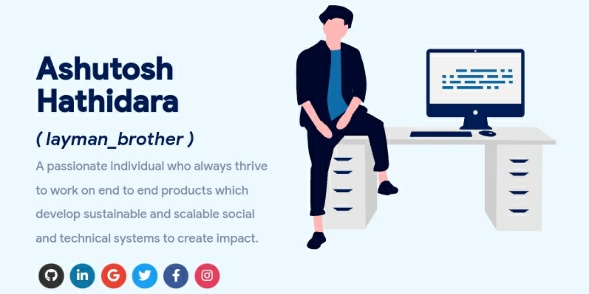

<p align="center">
  
</p>

<h1 align="center">Vishal Junghare Portfolio 🔥</h1>
<h3 align="center">
  A clean, responsive, and fully customized developer portfolio built with React,
  based on the masterPortfolio design and tailored for Vishal Junghare.
</h3>

<p align="center">
  
  
  
  
  
  
  
</p>

<p align="center">
  Built for showcasing backend engineering, AWS certifications, full stack skills,
  projects, experience, publications, and resume in a polished masterPortfolio-style layout.
</p>

---

# Sections 📚

✔️ Hero / Summary  
✔️ What I Do  
✔️ Skills  
✔️ Experience  
✔️ Certifications 🏆  
✔️ Education  
✔️ Projects  
✔️ Publications  
✔️ Contact Me  
✔️ Resume Viewer  
✔️ Splash Screen  
✔️ Light / Dark Theme Toggle  

---

# Table of Contents

- [Overview](#overview)
- [Clone and Use](#clone-and-use-)
- [Project Structure](#project-structure-)
- [Customize It](#customize-it-to-make-your-own-portfolio-)
- [Theme Toggle](#theme-toggle-)
- [Assets and Resume](#assets-and-resume-)
- [Deployment](#deployment-)
- [Technologies Used](#technologies-used-)
- [Credits](#credits-)
- [License](#license-)

---

# Overview

This repository contains the personal portfolio website of **Vishal Junghare**.

It is inspired by the **masterPortfolio** project and then customized to reflect:

- Vishal's personal branding
- custom hero and contact images
- updated favicon
- backend + AWS focused content
- experience and education details
- certification cards
- project and publication cards
- splash screen with Vishal's name
- light/dark theme toggle
- customized footer credit

This version is also **cleaned up** to keep only the files, assets, and sections that are actually used.

---

# Clone and Use 📋

This project is built with **React**, so you need **Node.js** and **npm** installed.

## 1. Clone the repository

```bash
git clone <your-repo-url>
````

## 2. Move into the project folder

```bash
cd <project-folder-name>
```

## 3. Install dependencies

```bash
npm install
```

## 4. Run the project locally

```bash
npm start
```

The app will open in your local browser in development mode.

---

# Project Structure 📁

```text
.
├── public/
│   ├── icons/
│   ├── index.html
│   ├── manifest.json
│   └── sitemap.xml
├── src/
│   ├── assets/
│   │   ├── docs/
│   │   ├── fonts/
│   │   ├── font-awesome/
│   │   └── images/
│   ├── components/
│   ├── containers/
│   ├── pages/
│   ├── shared/
│   ├── App.js
│   ├── portfolio.js
│   └── theme.js
├── package.json
└── README.md
```

---

# Customize It to Make Your Own Portfolio ✏️

In this project, the main customization happens through:

* `src/portfolio.js`
* `src/theme.js`
* `public/index.html`
* `src/assets/images/`
* `src/assets/docs/`

---

## Personal Information

You will find all major portfolio content inside:

```text
src/portfolio.js
```

This file controls:

* greeting / hero section
* social media links
* skills
* experience
* certifications
* education
* projects
* publications
* contact information
* footer text

You can directly update the content there and it will reflect across the portfolio.

---

## How to Change the Icons on the Homepage Under “What I Do”

This section is driven by the `skills` data inside `src/portfolio.js`.

### Using icons

1. Visit [Iconify](https://icon-sets.iconify.design/)
2. Search for the required icon
3. Copy the icon name
4. Paste it into the corresponding field in `portfolio.js`

### Using custom images

1. Add the image inside the appropriate assets folder
2. Reference it in the skill object
3. Adjust the styling if needed

---

## How to Change Education and Certification Logos

Education and certification cards support custom images.

To replace them:

1. Put the new logo file in:

```text
src/assets/images/
```

2. Update the image reference in:

```text
src/portfolio.js
```

This is currently how the project uses:

* institution logos
* company logos
* certification provider logos

---

# Theme Toggle 🌈

This project includes a **light/dark theme toggle** in the header.

### Current behavior:

* appears inline with the navigation links
* is smaller and aligned with the other menu items
* saves selected theme in `localStorage`
* restores the selected theme after refresh

### Theme colors are managed from:

```text
src/theme.js
```

You can:

* edit the current light and dark themes
* add new themes
* switch the default palette

---

# Assets and Resume 📃

## Images

All custom project images are stored in:

```text
src/assets/images/
```

This includes:

* hero photo
* contact illustration/photo
* company logos
* education logos
* certification logos
* project visuals

---

## Resume

To replace the resume:

1. Add your PDF to:

```text
src/assets/docs/
```

2. Open:

```text
src/pages/resume/Resume.js
```

3. Replace the imported file name with your resume file name

Example:

```javascript
import myResumePdf from "../../assets/docs/Vishal_Junghare_Resume.pdf";
```

---

## Favicon and Metadata

Update page metadata and favicon from:

```text
public/index.html
public/icons/
```

You can replace:

* browser tab title
* meta description
* social preview image
* favicon icons

---

# Deployment 📦

After finishing your setup, generate a production build using:

```bash
npm run build
```

You can deploy the generated app using:

* **Vercel**
* **Netlify**
* **GitHub Pages**
* **Firebase Hosting**

If deploying through GitHub Pages, make sure to update the `homepage` field in `package.json`.

---

# Features Added in This Customized Version ✨

* personalized hero image instead of default animated illustration
* custom contact section image
* cleaned project structure
* updated education cards with institution logos
* updated company logos in experience
* publications section with mixed content
* custom favicon
* splash screen updated with Vishal's name
* restored personalized footer text
* smaller inline theme toggle
* masterPortfolio-style layout with Vishal's actual content

---

# Technologies Used 🛠️

* [React](https://reactjs.org/)
* [React Router](https://reactrouter.com/)
* [Styled Components](https://styled-components.com/)
* [Base Web](https://baseweb.design/)
* [React Reveal](https://www.react-reveal.com/)
* [React PDF](https://github.com/wojtekmaj/react-pdf)
* [Chart.js](https://www.chartjs.org/)

---

# Notes 📌

* This project is a **customized portfolio**, not the original masterPortfolio repo.
* Unused template sections were removed to keep the codebase cleaner.
* The current structure only keeps the features actively used by Vishal's portfolio.

---

# Credits 👏

This repository has been customized and cleaned specifically for **Vishal Junghare**.

---
